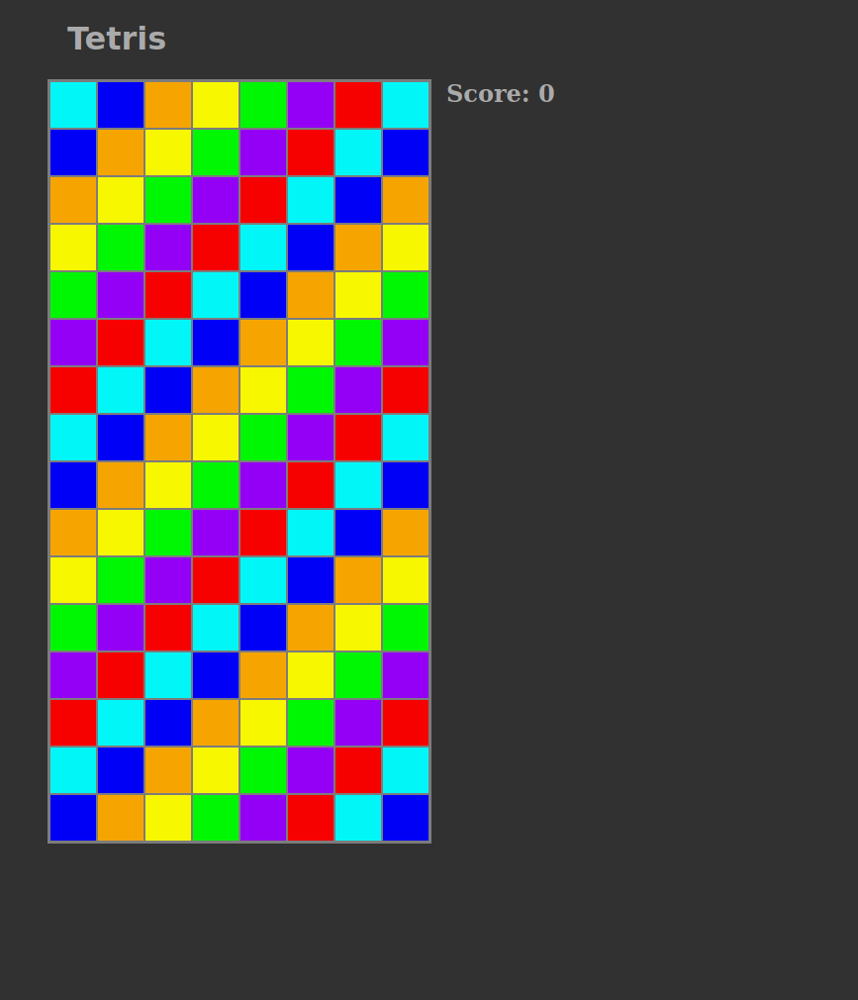

# A Tetris clone
Made using p5js over the span of a few days.

Made mostly for my own entertainment, expect nothing good

## Todo:
- [x] Drawing blocks and grid
- [x] Movement
- [x] Basic rotation
- [x] Points and clearing lines
- [x] Proper tetris spawning
- [x] INTERMISSION: UI Sprucing up with html(Meh good enough 4 now)
- [x] Pause
- [x] More intermission: Demo screen for github swag
- [x] Lose condition and basic warning
- [ ] Next box
- [ ] Hold functionality
- [ ] Smarter rotation
- [ ] Win/lose screens

I might not implement any of the above, or i might refactor this list entirely

## Sources:
- [Tetris wiki](https://tetris.fandom.com/wiki/SRS?file=SRS-pieces.png)  
- [Tetris wiki randomness](https://tetris.fandom.com/wiki/Random_Generator)
- [P5 reference](https://p5js.org/reference/)
- [An extremely opinionated view](https://github.com/mrcpj1998)
